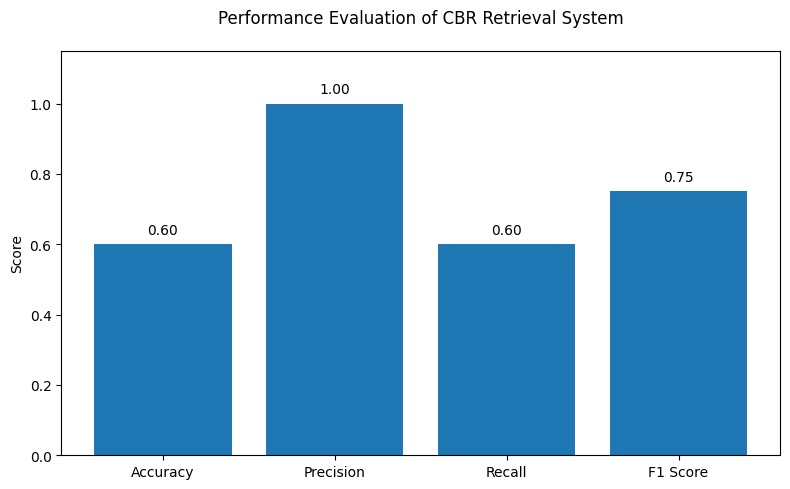

# Sistem Case-Based Reasoning (CBR) untuk Analisis Putusan Tindak Pidana Korupsi

## Deskripsi Proyek

Proyek ini bertujuan membangun sistem Case-Based Reasoning (CBR) sederhana untuk membantu pencarian putusan tindak pidana korupsi yang memiliki kemiripan dengan kasus baru.

Data yang digunakan berasal dari Direktori Putusan Mahkamah Agung Republik Indonesia dengan domain perkara Tindak Pidana Korupsi (Tipikor).

Sistem mengikuti siklus Case-Based Reasoning (CBR), yaitu:

1. Membangun Case Base
2. Case Representation
3. Case Retrieval
4. Case Solution Reuse
5. Model Evaluation

---

## Dataset

Dataset diperoleh dari Direktori Putusan Mahkamah Agung Republik Indonesia dengan domain perkara Tindak Pidana Korupsi (Tipikor).

Karakteristik dataset:

- Jumlah dokumen: 40 putusan
- Format awal: PDF
- Format setelah preprocessing: TXT
- Sumber: https://putusan3.mahkamahagung.go.id/

Setiap dokumen berisi informasi seperti:
- Nomor perkara
- Identitas terdakwa
- Pasal yang digunakan
- Uraian fakta persidangan
- Pertimbangan hukum
- Amar putusan
  
---

## Struktur Repository

```text
CBR-Putusan-Korupsi/
│
├── README.md
├── requirements.txt
│
├── data/
│   ├── raw/
│   │   ├── case_001.txt
│   │   ├── case_002.txt
│   │   ├── case_003.txt
│   │   └── ...
│   │
│   ├── processed/
│   │   └── cases.zip
│   │
│   ├── eval/
│   │   ├── queries.json
│   │   ├── retrieval_metrics.csv
│   │   └── error_analysis.csv
│   │
│   └── results/
│       └── predictions.csv
│
├── log/
│   └── cleaning.log
│
└── notebooks/
    ├── 01_case_base.ipynb
    ├── 02_case_representation.ipynb
    ├── 03_case_retrieval.ipynb
    ├── 04_reuse_prediction.ipynb
    └── 05_evaluation.ipynb
```

## Instalasi

1. Clone repository

```bash
git clone <url_repository>
cd CBR-Putusan-Korupsi
```

2. Install seluruh dependensi

```bash
pip install -r requirements.txt
```

3. Jalankan Jupyter Notebook

```bash
jupyter notebook
```

4. Buka folder notebooks dan jalankan notebook sesuai urutan pipeline.

## Tahapan Pengerjaan

### 1. Membangun Case Base

Melakukan:
- Konversi PDF ke TXT
- Pembersihan teks
- Normalisasi dokumen

Output:
```text
data/raw/
```

### 2. Case Representation

Ekstraksi informasi penting:

- Nomor perkara
- Pasal
- Terdakwa
- Amar putusan
- Teks putusan

Output:
```text
data/processed/cases.csv
```

### 3. Case Retrieval

Dokumen putusan direpresentasikan menggunakan TF-IDF dan tingkat kemiripan antar dokumen dihitung menggunakan Cosine Similarity. Sistem kemudian mengembalikan beberapa putusan dengan nilai kemiripan tertinggi sebagai referensi kasus.

Input:
- Ringkasan kasus baru atau teks putusan

Output:
- Top-k putusan yang paling mirip
- Nilai similarity setiap putusan
- Daftar case_id hasil retrieval

File hasil:
```text
data/eval/queries.json
```

### 4. Case Solution Reuse

Hasil retrieval digunakan untuk menghasilkan rekomendasi solusi bagi kasus baru. Amar putusan dari kasus-kasus yang memiliki kemiripan tertinggi digunakan sebagai referensi dalam proses prediksi solusi.

Input:
- Daftar top-k kasus hasil retrieval

Output:
- Prediksi solusi atau rekomendasi amar putusan untuk kasus baru

File hasil:
```text
data/results/predictions.csv
```

### 5. Evaluasi Model

Kinerja sistem dievaluasi menggunakan metrik Accuracy, Precision, Recall, dan F1-Score. Hasil evaluasi digunakan untuk menganalisis performa retrieval dan prediksi solusi.

Output:

```text
data/eval/retrieval_metrics.csv
data/eval/error_analysis.csv
```

## Cara Menjalankan

Notebook harus dijalankan secara berurutan karena output dari setiap tahap digunakan sebagai input pada tahap berikutnya.

```text
01_case_base.ipynb
↓
02_case_representation.ipynb
↓
03_case_retrieval.ipynb
↓
04_reuse_prediction.ipynb
↓
05_evaluation.ipynb
```
## Hasil yang Diharapkan

Sistem menghasilkan:

1. Basis kasus yang telah dibersihkan dan terstruktur.
2. Representasi kasus dalam format CSV.
3. Daftar putusan yang paling mirip terhadap kasus baru.
4. Prediksi solusi berdasarkan kasus-kasus yang memiliki kemiripan tertinggi.
5. Hasil evaluasi model berupa Accuracy, Precision, Recall, dan F1-Score.

## Visualisasi Evaluasi

Grafik berikut menunjukkan performa model berdasarkan metrik Accuracy, Precision, Recall, dan F1-Score.


